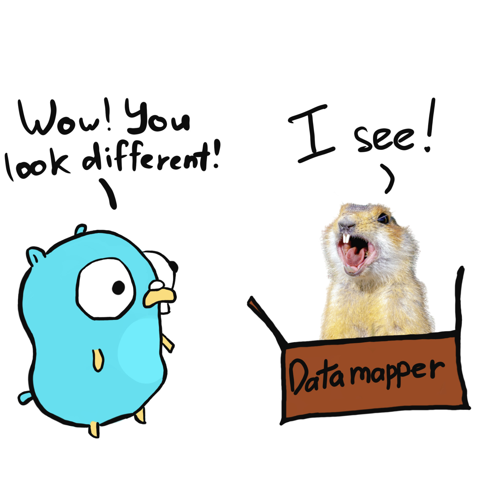

# Datamapper



[](https://goreportcard.com/report/github.com/underbek/datamapper)
[](https://github.com/underbek/datamapper/releases/latest)

**Datamapper** is a library written in [Golang](https://go.dev/). It allows you to convert models to each other using tags. If you are tired of writing a lot of converters for structures, you will definitely like Datamapper :)

## Getting started

### Install

Let's start by installing Datamapper:

```shell
go install github.com/underbek/datamapper@latest
```

### Usage

Datamapper provides the ability to customize model conversion using flags:

```text
Usage:
  datamapper [OPTIONS]

Application Options:
  -c, --config=        Yaml config path
  -v, --version        Current version
  -d, --destination=   Destination file path
      --cf=            User conversion functions sources/packages. Can add package alias like {package_path}:{alias)
      --from=          Model from name
      --from-tag=      Model from tag (default: map)
      --from-source=   From model source/package. Can add package alias like {package_path}:{alias) (default: .)
      --to=            Model to name
      --to-tag=        Model to tag (default: map)
      --to-source=     To model source/package. Can add package alias like {package_path}:{alias) (default: .)
  -i, --inverse        Create direct and inverse conversions
  -r, --recursive      Parse recursive fields and create conversion if it not exists
  -p, --with-pointers  If field is pointer and recursive flag enabled then create convertors with pointers

Help Options:
  -h, --help           Show this help message
```

### Config:

Datamapper can read configuration file by `config` flag:

_Config example:_
```yaml
# array of conversion functions
conversion-functions:
  ## source path or full package name
  - source: github.com/underbek/datamapper/_test_data/mapper/convertors
    ## optional package alias
    alias: cf
  - source: github.com/underbek/datamapper/_test_data/mapper/other_convertors

# array of conversion mapping
options:
  ## From model
  - from:
      ## name of model (can use with pointer)
      name: "*User"
      ## mapping tag (optional|default = map)
      tag : map
      ## source path or full package name
      source: github.com/underbek/datamapper/_test_data/mapper/domain
      ## optional package alias
      alias: domain
    ## From model like a from model
    to:
      name: "User"
      source: github.com/underbek/datamapper/_test_data/mapper/transport
    ## Destination file path
    destination: _test_data/local_test/domain_to_dto_user_converter.go
    ## If you need to crate inverse conversions
    inverse: true
    ## Parse recursive fields and create conversion if it not exists (default = false)
    recursive: false
    ## If field is pointer and recursive flag enabled then create convertors with pointers (default = false)
    with-pointers: false

  - from:
      name: "User"
      source: github.com/underbek/datamapper/_test_data/mapper/broken
      alias: bk
      tag: map
    to:
      name: "*User"
      source: github.com/underbek/datamapper/_test_data/mapper/domain
      alias: dm
      tag: map
    destination: _test_data/local_test/broken_to_domain_user_converter.go
    inverse: true
```

### Conversion functions

Datamapper already has converters for basic types. You can look into them [here](https://github.com/underbek/datamapper/tree/main/converts).
In addition, you can use your own converters:

- by types

```go
package conversion

import "fmt"

func ConvertIntToString(from int) string {
	return fmt.Sprint(from)
}
```

- by generics

```go
package conversion

import "fmt"

func ConvertAnyToString[T int | uint | float32](from T) string {
	return fmt.Sprint(from)
}

func ConvertStringToMany[T int | uint | float32](from int) T {
	return T(from)
}

func ConvertAnyToMany[T, V int | uint | float32](from T) V {
	return V(from)
}
```

- with error

```go
package converts

import "github.com/shopspring/decimal"

func ConvertStringToDecimal(from string) (decimal.Decimal, error) {
	return decimal.NewFromString(from)
}
```

### Features

* [x] Parse and filter tag
* [x] Generate empty convertor
* [x] Map similar types
* [x] Simple convertor test
* [x] Create conversion functions
* [x] Use conversion functions in convertor
* [x] Parse conversion functions from sources
* [x] Parse generic types from other package (constrains.Float)
* [x] Parse conversion functions with generic from
* [x] Parse conversion functions with generic to
* [x] Parse conversion functions with generic from and to
* [x] Parse conversion functions with generic struct
* [x] Parse conversion functions with struct
* [x] Create base conversation source
* [x] Generate convertors by other package models
* [x] Generate convertors by other package fields in models
* [x] Generate convertors by same package conversion functions
* [x] Fix tests
* [x] Delete package flag
* [x] First mapper tests
* [x] Use other conversion functions in convertor
* [x] Use conversion functions with error -> convertor with error
* [x] Convert with pointer field
* [x] Convert with pointer field with error
* [x] No nil err if from and to fields are pointers
* [x] Add CI with tests and linters
* [x] Parse other package
* [x] First console generate
* [x] Set default options
* [x] Add generation info
* [x] Fill readme
* [x] First release
* [x] Get first value by tag
* [x] Move main to root
* [x] Alias package name for (from/to) models and custom cf
* [x] Use conversion functions with pointers
* [x] Use some conversion functions sources
* [x] Parse type alias
* [x] Parse array, slice, map
* [x] Generate convertors by slice fields
* [x] New alias options (alias to each convertors' path)
* [x] Converts both ways in one source
* [x] Generate convertor with from/to pointer
* [x] Fix error by parsing function as member
* [x] Wrap errors
* [x] Parse packages with broken sources
* [x] Recursive convert by option if not found conversions
* [x] Parse user struct in struct
* [x] Use generated convertors in convertor like conversion function
* [x] Generator must be return function model
* [x] Use conversion functions from datamapper package without parsing
* [x] Update readme
* [ ] Use one destination for models convertors by recursive flag
* [ ] Map field without tag
* [ ] Generate convertors with map fields
* [ ] Generate convertors with array fields
* [ ] Option for default field value if from field is nil
* [ ] Parse comments
* [ ] Parse embed struct
* [ ] Parse func aliases
* [ ] Warning or error politics if tags is not equals
* [ ] Fill some conversion functions
* [ ] Copy using conversion functions from datamapper to target service if flag set
* [ ] Parse custom error by conversion functions
* [ ] Fix cyclop linter

### Example of the code generated by the library

```go
// Code generated by datamapper.
// https://github.com/underbek/datamapper

// Package with_field_slice_pointers_and_errors is a generated datamapper package.
package with_field_slice_pointers_and_errors

import (
	"errors"
	"fmt"

	"github.com/shopspring/decimal"
	"github.com/underbek/datamapper/_test_data/generator/with_field_slice_pointers_and_errors/cf"
)

// ConvertFromToTo convert From by tag map to To by tag map
func ConvertFromToTo(from From) (To, error) {
	fromIDs := make([]*int, 0, len(from.IDs))
	for _, item := range from.IDs {
		res, err := cf.ConvertDecimalToInt(item)
		if err != nil {
			return To{}, fmt.Errorf("convert From.IDs -> To.UUIDs failed: %w", err)
		}

		fromIDs = append(fromIDs, &res)
	}

	fromAges := make([]int, 0, len(from.Ages))
	for _, item := range from.Ages {
		if item == nil {
			return To{}, errors.New("cannot convert From.Ages -> To.Ages, field is nil")
		}

		res, err := cf.ConvertDecimalToInt(*item)
		if err != nil {
			return To{}, fmt.Errorf("convert From.Ages -> To.Ages failed: %w", err)
		}

		fromAges = append(fromAges, res)
	}

	fromCounts := make([]*decimal.Decimal, 0, len(from.Counts))
	for _, item := range from.Counts {
		var resPtr *decimal.Decimal
		if item != nil {
			res, err := cf.ConvertIntegerToDecimal(*item)
			if err != nil {
				return To{}, fmt.Errorf("convert From.Counts -> To.Counts failed: %w", err)
			}

			resPtr = &res
		}

		fromCounts = append(fromCounts, resPtr)
	}

	fromOrigins := make([]*decimal.Decimal, 0, len(from.Origins))
	for _, item := range from.Origins {
		res, err := cf.ConvertFloatPtrToDecimalPtr(item)
		if err != nil {
			return To{}, fmt.Errorf("convert From.Origins -> To.Origins failed: %w", err)
		}

		fromOrigins = append(fromOrigins, res)
	}

	return To{
		UUIDs:   fromIDs,
		Ages:    fromAges,
		Counts:  fromCounts,
		Origins: fromOrigins,
	}, nil
}
```
